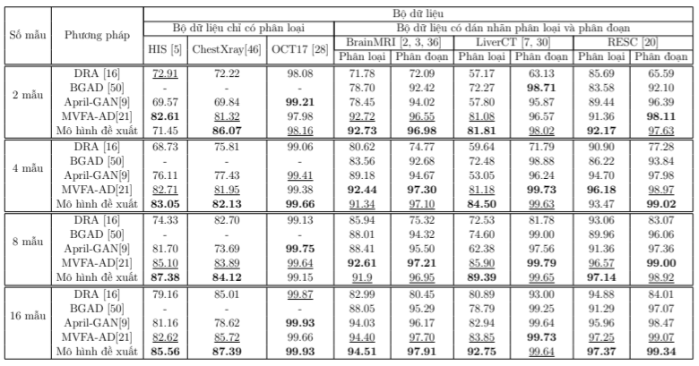

# MLA-LP: Multi-level Adapters with Learning Prompt for medical image anomaly detection

## Installation
```bash
pip install torch torchvision torchaudio --index-url https://download.pytorch.org/whl/cu118
pip install -r requirements.txt
```

## Quick Start

Train few shot (k=4) for `Brain`
```bash
python train_few.py --obj Brain --shot 4
```

Train zero-shot for `Liver`
```bash
python train_zero.py --obj Liver 
```

## Results

### Few shot



### zero shot


### Visualization
