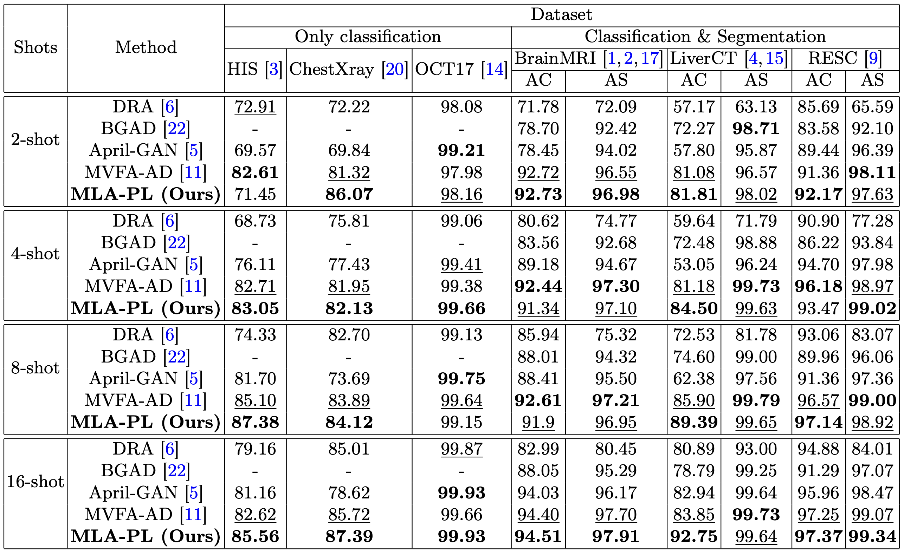
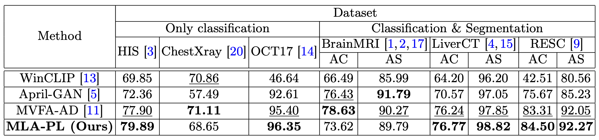
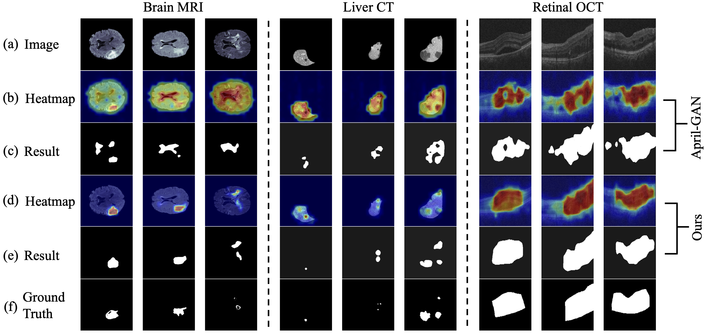

# MLA-LP: Multi-Level Adapters with Learnable Prompt for Medical Image Anomaly Detection

This repository contains the implementation of the **Multi-Level Adapters with Learnable Prompt (MLA-LP)** model for medical image anomaly detection, as described in the paper:

**"Abnormality Detection in Medical Images Based on Visual-Language Model"**  
Hoang-Phu Thanh-Luong, Van-Thai Vu, and Quoc-Ngoc Ly  
University of Science, Vietnam National University, Ho Chi Minh City, Vietnam

The full paper, **"Abnormality Detection in Medical Images Based on Visual-Language Model"**, is available at:  
[Read the paper](https://cv4dc.github.io/files/2024/papers/16.pdf)

## Overview

The MLA-LP model leverages the pre-trained **CLIP** vision-language model, enhanced with multi-level adapters and learnable prompts, to address the challenge of detecting and segmenting abnormalities in medical images. The model excels in both **zero-shot** and **few-shot** learning scenarios, achieving superior performance in anomaly classification (AC) and anomaly segmentation (AS) tasks across diverse medical imaging datasets.


_The overview of our proposed MLA-LP model._

### Learnable Prompt

In medical anomaly detection, using **learnable prompts** in text-based encoding offers a highly effective approach for enhancing system performance. Text provides rich semantic context and a flexible, abstract representation of abnormalities in medical images. This enables models to **adapt dynamically across different clinical scenarios**, improving both feature extraction and the accuracy of classification and segmentation tasks.

The core idea of learnable prompts is to represent prompt context using a set of trainable vectors, which are optimized during training to minimize both classification and segmentation loss. Rather than depending on static, handcrafted templates, these prompts allow the system to learn context-specific cues automatically—capturing subtle differences between normal and abnormal patterns in a wide range of medical imaging settings.

### Adapters

In this section, we introduce the Visual Adapter, a module designed to extract and refine local features to support both classification and segmentation tasks.

The adapter follows a bottleneck design, implemented using a sequence of linear layers. As illustrated in Figure 2(a), the input to the adapter is a feature map F extracted from the CLIP model. The Visual Adapter is composed of two specialized modules:

- A\_{ac}: The classification adapter

- A\_{as}: The segmentation adapter

Both adapters are built using the same bottleneck architecture, which allows efficient transformation of features before feeding them back into the CLIP image encoder.

As shown in Figure 2(b), each adapter module consists of two linear layers with a LeakyReLU activation function in between, forming a lightweight yet expressive transformation pipeline.


_Illustration of the Visual Adapter architecture. (a) The left figure presents the general architecture of the Visual Adapter, comprising two modules: the classification adapter Aac and the segmentation adapter Aas. (b) The right figure details the architecture of each adapter module Aac/as._

## Key Features

- **Multi-Level Adapters**: Adapts intermediate layers of CLIP’s visual encoder to capture medical-specific features.
- **Learnable Prompts**: Dynamically adjusts textual prompts to improve flexibility and generalization across medical datasets.
- **Zero-Shot and Few-Shot Learning**: Performs effectively with minimal or no labeled data.
- **Datasets Evaluated**: ChestXray, HIS, OCT17, BrainMRI, LiverCT, RESC.

## Performance

- **Few-Shot Setting**: Achieves an average AUC improvement of **0.28%** for anomaly classification and **0.08%** for anomaly segmentation compared to state-of-the-art models.
- **Zero-Shot Setting**: Achieves an average AUC improvement of **0.39%** for anomaly classification.

## Installation

To set up the environment for running the MLA-LP model, follow these steps:

```bash
# Install PyTorch with CUDA support (adjust based on your system)
pip install torch torchvision torchaudio --index-url https://download.pytorch.org/whl/cu118

# Install additional dependencies
pip install -r requirements.txt
```

Ensure you have a compatible CUDA-enabled GPU for optimal performance. The `requirements.txt` file includes all necessary Python packages.

## Quick Start

### Training in Few-Shot Setting

To train the model in a few-shot setting (e.g., k=4 shots) for the `Brain` dataset:

```bash
python train_few.py --obj Brain --shot 4
```

### Training in Zero-Shot Setting

To train the model in a zero-shot setting for the `Liver` dataset:

```bash
python train_zero.py --obj Liver
```

### Notes

- Replace `--obj` with other supported datasets (e.g., `ChestXray`, `HIS`, `OCT17`, `BrainMRI`, `LiverCT`, `RESC`) as needed.
- Ensure the dataset is properly formatted and accessible in the specified directory (see `data/` for details).

## Results

### Few-Shot Learning

The model demonstrates superior performance in few-shot settings, particularly with 16-shot configurations. The table below summarizes the AUC (%) for anomaly classification (AC) and anomaly segmentation (AS) across benchmark datasets, compared to state-of-the-art methods (data sourced from Huang et al. [11]).



### Zero-Shot Learning

In zero-shot scenarios, the model achieves competitive performance without requiring labeled training data.



### Visualization

Visualizations of anomaly detection and segmentation results are provided to illustrate the model’s capability to localize abnormalities in medical images.



## Datasets

The MLA-LP model was evaluated on the following benchmark datasets:

- **ChestXray**: Hospital-scale chest X-ray database.
- **HIS**: Dataset for lymph node metastasis detection.
- **OCT17**: Optical coherence tomography dataset.
- **BrainMRI**: Multimodal brain tumor segmentation dataset.
- **LiverCT**: Liver tumor segmentation benchmark.
- **RESC**: Additional medical imaging dataset.

Please refer to the respective citations for details on accessing and preparing these datasets.

## Future Work

- **Multi-Level Adapter Forward Prompt Learner**: Exploring further enhancements to the adapter and prompt learning mechanisms.
- **Bone Dataset**: Developing a new bone dataset for classification and segmentation tasks, with plans for public release to support the medical research community.
- **Limitations Analysis**: Investigating specific datasets where the model may underperform to better understand its strengths and weaknesses.

## Contact

For questions, feedback, or collaboration inquiries, please reach out to:

- **Hoang-Phu Thanh-Luong**: [20120548@student.hcmus.edu.vn](mailto:20120548@student.hcmus.edu.vn)
- **Vũ Văn Thái**: [20120579@student.hcmus.edu.vn](mailto:20120579@student.hcmus.edu.vn)

## Acknowledgments

This research is supported by funding from the **University of Science, Vietnam National University - Ho Chi Minh City**.
